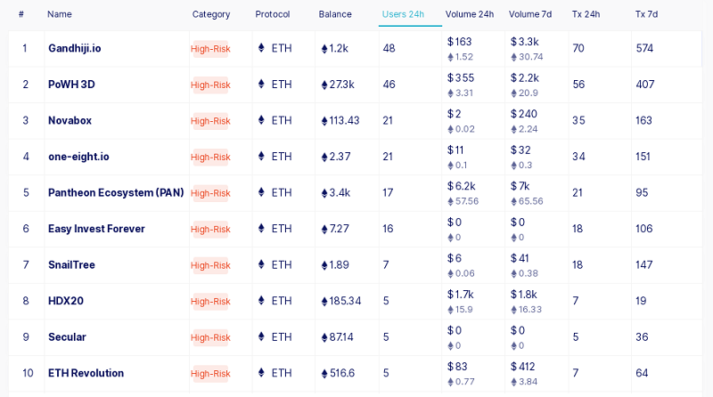

For more blockchain books, see the [**Best of Crypto Books page »**](https://openblockchains.github.io/crypto-books/)

---


# Programming Crypto Blockchain Contracts Step-by-Step Book / Guide

_Let's Start with Ponzi & Pyramid Schemes. Run Your Own Lotteries, Gambling Casinos and more on the Blockchain World Computer..._


**BEWARE: Gambling is fun and addictive. Winning and losing. Up and down.
Treat crypto "games" as entertainment like casino gambling, sports betting or poker cards playing.
Do NOT "invest" trying to get-rich-quick
or raise the stakes trying to win back what you have lost, and so on.**


## Ponzis and Pyramids

### Simple Ponzi - Investment of a Lifetime!

Let's start with a simple ponzi scheme contract:

``` ruby
class SimplePonzi < Contract

  def initialize
    @current_investor   = msg.sender
    @current_investment = 0
  end

  def receive
    # note: new investments must be 10% greater than current
    minimum_investment = @current_investment * 11 / 10
    assert( msg.value > minimum_investment )

    # record new investor
    previous_investor   = @current_investor
    @current_investor   = msg.sender
    @current_investment = msg.value

    # pay out previous investor
    previous_investor.send( msg.value )
  end

end # class SimplePonzi
```

(Source: [`ponzi_simple.rb`](ponzi_simple.rb))


What's a ponzi scheme?


(Source: [Best of Bitcoin Maximalist - Scammers, Morons, Clowns, Shills & BagHODLers - Inside The New New Crypto Ponzi Economics](https://bitsblocks.github.io/bitcoin-maximalist))


> A Ponzi scheme is a form of fraud which lures investors and pays profits to earlier investors by using funds obtained from more recent investors. The victims are led to believe that the profits are coming from product sales or other means, and they remain unaware that other investors are the source of profits. A Ponzi scheme is able to maintain the illusion of a sustainable business as long as there continue to be new investors willing to contribute new funds, and as long as most of the investors do not demand full repayment and are willing to believe in the non-existent assets that they are purported to own.
The scheme is named after Charles Ponzi who became notorious for using the technique in the 1920s.
>
> -- [Ponzi Scheme @ Wikipedia](https://en.wikipedia.org/wiki/Ponzi_scheme)


Back to the future. Now in 2019 ponzi schemes are as popular as ever. For
modern Get-Rich-Quick "verifiable corrupt" or "honest" ponzi schemes
running on the blockchain
browse the ["high-risk" category](https://dappradar.com/rankings/protocol/ethereum/category/high-risk) of contract scripts
running on Ethereum, for example.




Anyways, let's look at the first simple ponzi contract script.
The idea is:

The money sent in by the latest investor
gets paid out to the previous investor and because every
new investment must be at least 10% larger than the last
investment - EVERY INVESTOR WINS! (*)

(*): Except the last "sucker" is HODLing the bag waiting for a greater fool.


Let's setup some test accounts with funny money:

``` ruby
## setup test accounts with starter balance
Account[ '0x1111' ].balance = 0
Account[ '0xaaaa' ].balance = 1_000_000
Account[ '0xbbbb' ].balance = 1_200_000
Account[ '0xcccc' ].balance = 1_400_000

## (pp) pretty print  all known accounts with balance
pp Uni.accounts      # Uni (short for) Universum
```

(Source: [`run_ponzi_simple.rb`](run_ponzi_simple.rb))


printing:

```
[#<Account @address="0x1111", @balance=0>,
 #<Account @address="0xaaaa", @balance=1000000>,
 #<Account @address="0xbbbb", @balance=1200000>,
 #<Account @address="0xcccc", @balance=1400000>]
 ```

Note: The contract scripts run on Universum - a 3rd generation blockchain / world computer. New to Universum? See the [Universum (World Computer) White Paper](https://github.com/openblockchains/universum/blob/master/WHITEPAPER.md)!


And let's invest:

``` ruby
## genesis - create contract
ponzi = Uni.send_transaction( from: '0x1111', data: SimplePonzi ).contract
pp ponzi
#=> #<SimplePonzi @current_investment=0, @current_investor="0x1111">

Uni.send_transaction( from: '0xaaaa', to: ponzi, value: 1_000_000 )
pp ponzi
#=> #<SimplePonzi @current_investment=1000000, @current_investor="0xaaaa">

Uni.send_transaction( from: '0xbbbb', to: ponzi, value: 1_200_000 )
pp ponzi
#=> #<SimplePonzi @current_investment=1200000, @current_investor="0xbbbb">

Uni.send_transaction( from: '0xcccc', to: ponzi, value: 1_400_000 )
pp ponzi
#=> #<SimplePonzi @current_investment=1400000, @current_investor="0xcccc">

## (pp) pretty print all known accounts with balance
pp Uni.accounts
```

Resulting in:

```
[#<Account @address="0x1111", @balance=1000000>,
 #<Account @address="0xaaaa", @balance=1200000>,
 #<Account @address="0xbbbb", @balance=1400000>,
 #<Account @address="0xcccc", @balance=0>]
```

The "Genesis" `0x1111` account made a 100% profit of 1_000_000.
The `0xaaaa` account made an investment of 1_000_000 and got 1_200_000. 200_000 profit! Yes, it works!
The `0xbbbb` account made an investment of 1_200_000 and got 1_400_000. 200_000 profit! Yes, it works!
The `0xcccc` account is still waiting for a greater fool and is HODLing the bag.
To the moon!


### Gradual Ponzi - May the Brave be Rewared with Riches!

Let's put together a more realistic ponzi
where investor get above-average returns gradually
as more investors join in:


``` ruby
class GradualPonzi < Contract

  MINIMUM_INVESTMENT = 1_000_000

  def initialize
    @investors = []                   # Array.of( Address )
    @investors.push( msg.sender )

    @balances = Mapping.of( Address => Money ) 
  end


  def receive
    assert( msg.value >= MINIMUM_INVESTMENT )

    investor_share = msg.value / @investors.size
    @investors.each do |investor|
      @balances[investor] += investor_share
    end

    @investors.push( msg.sender )
  end


  def withdraw
    payout = @balances[ msg.sender ]
    @balances[ msg.sender ] = 0
    msg.sender.transfer( payout )
  end
end # class GradualPonzi
```

(Source: [`ponzi_gradual.rb`](ponzi_gradual.rb))


The improved ponzi formula is:

The investment scheme has a 1_000_000 minimum
to keep out "free loaders"
and every new investment gets shared evenly
between all previous investors.
At any time investors can withdraw all profits made
BUT not the initial investment.


Let's setup some test accounts with funny money:

``` ruby
## setup test accounts with starter balance
Account[ '0x1111' ].balance = 0
Account[ '0xaaaa' ].balance = 1_000_000
Account[ '0xbbbb' ].balance = 1_000_000
Account[ '0xcccc' ].balance = 1_000_000
Account[ '0xdddd' ].balance = 1_000_000

## (pp) pretty print all known accounts with balance
pp Uni.accounts      # Uni (short for) Universum
```

(Source: [`run_ponzi_gradual.rb`](run_ponzi_gradual.rb))

printing:

```
[#<Account @address="0x1111", @balance=0>,
 #<Account @address="0xaaaa", @balance=1000000>,
 #<Account @address="0xbbbb", @balance=1000000>,
 #<Account @address="0xcccc", @balance=1000000>,
 #<Account @address="0xdddd", @balance=1000000>]
```

And let's invest:

``` ruby
## genesis - create contract
ponzi = Uni.send_transaction( from: '0x1111', data: GradualPonzi ).contract
pp ponzi
#=> #<GradualPonzi
#       @balances={},
#       @investors=["0x1111"]>

Uni.send_transaction( from: '0xaaaa', to: ponzi, value: 1_000_000 )
pp ponzi
#=> #<GradualPonzi
#      @balances={"0x1111"=>1000000},
#      @investors=["0x1111", "0xaaaa"]>

Uni.send_transaction( from: '0xbbbb', to: ponzi, value: 1_000_000 )
pp ponzi
#=> #<GradualPonzi
#      @balances={"0x1111"=>1500000, "0xaaaa"=>500000},
#      @investors=["0x1111", "0xaaaa", "0xbbbb"]>

Uni.send_transaction( from: '0xcccc', to: ponzi, value: 1_000_000 )
pp ponzi
#=> #<GradualPonzi
#      @balances={"0x1111"=>1833333, "0xaaaa"=>833333, "0xbbbb"=>333333},
#      @investors=["0x1111", "0xaaaa", "0xbbbb", "0xcccc"]>

Uni.send_transaction( from: '0xdddd', to: ponzi, value: 1_000_000 )
pp ponzi
#=> #<GradualPonzi
#      @balances={"0x1111"=>2083333, "0xaaaa"=>1083333,
#                 "0xbbbb"=>583333,  "0xcccc"=>250000},
#      @investors=["0x1111", "0xaaaa", "0xbbbb", "0xcccc", "0xdddd"]>

## (pp) pretty print all known accounts with balance
pp Uni.accounts
```

Resulting in:

```
[#<Account @address="0x1111", @balance=0>,
 #<Account @address="0xaaaa", @balance=0>,
 #<Account @address="0xbbbb", @balance=0>,
 #<Account @address="0xcccc", @balance=0>,
 #<Account @address="0xdddd", @balance=0>]
```

Note: All accounts have a balance of 0 because
the investment (and profits) are this time safely kept in the ponzi!

The "Genesis" `0x1111` account made a 100% profit of 2_083_333.
The `0xaaaa` account made an investment of 1_000_000 and got 1_083_333. 83_333 profit! Yes, it works!
The `0xbbbb` account made an investment of 1_000_000 and got 583_333 so far. HODL! HODL!
The `0xcccc` got 250_000 so far. HODL! HODL!
The `0xdddd` account is still waiting for greater fools and is HODLing the bag.
To the moon!


Let's withdraw and pocket the profits:

``` ruby
Uni.send_transaction( from: '0xaaaa', to: ponzi, data: [:withdraw] )
pp ponzi
#=> #<GradualPonzi
#       @balances={"0x1111"=>2083333, "0xaaaa"=>0,
#                  "0xbbbb"=>583333,  "0xcccc"=>250000},
#       @investors=["0x1111", "0xaaaa", "0xbbbb", "0xcccc", "0xdddd"]>

## (pp) pretty print all known accounts with balance
pp Uni.accounts
```

resulting in:

```
[#<Account @address="0x1111", @balance=0>,
 #<Account @address="0xaaaa", @balance=1083333>,
 #<Account @address="0xbbbb", @balance=0>,
 #<Account @address="0xcccc", @balance=0>,
 #<Account @address="0xdddd", @balance=0>]
```

Yes, it's real!
The `0xaaaa` account keeps getting more (and more) profits in the ponzi
(see the `@investors` list) and
got already ALL the investment back with 83_333 profits!


##  Ponzi Governmental - Real World Case Study - Last Creditor (Before Collapse) Wins the Jackpot!

Let's look at a real world ponzi (scheme) contract called Governmental
put together by an Austrian School of Economics fan boy or girl.


What's Governmental?

The gambling website says:

> This is an educational game which simulates the finances of a government -
> in other words: It's a Ponzi scheme
>
> Rule 1
>
> You can lend the government money - they promise to pay it back +10% interest.
> Minimum contribution is 1 ETH.
>
> Rule 2
>
> If the government does not receive new money for 12h the system breaks down. The latest
> creditor saw the crash coming and receives the jackpot. All others will lose their claims.
>
> Rule 3
>
> All incoming money is used in the following way: 5% goes into the "jackpot" (capped at 10 000 ETH), 
> 5% goes to the corrupt elite that runs the government, 
> 90% are used to pay out creditors in order of their date of credit. 
> When the jackpot is full, 95% go toward the payout of creditors.
>
> Rule 4
>
> Creditors can share an affiliate link. Money deposited this way is distributed
> as follows: 5% go toward the linker directly, 5% to the corrupt elite,
> 5% into the jackpot (until full). The rest is used for payouts.
>
> (Source: [`governmental.github.io/GovernMental`](http://governmental.github.io/GovernMental/)


Believe it or not the contract ran in early 2016 for about 40 days on
the Ethereum blockchain and
was so popular that the payout money got stuck because of too many investors
and the payout function was hitting the gas limit
(that is, maximum number of instructions).
Read the official announcement titled
[">1000 ETH Jackpot! New Contract - "Governmental" Government Simulation"](https://bitcointalk.org/index.php?topic=1424324.0)

Anyways, let's look at the code (in JavaScript-like Solidity),
see [etherscan.io/address/0xF45717552f12Ef7cb65e95476F217Ea008167Ae3#code](https://etherscan.io/address/0xF45717552f12Ef7cb65e95476F217Ea008167Ae3#code):

``` solidity
contract Government {

    // Global Variables
    uint32 public lastCreditorPayedOut;
    uint public lastTimeOfNewCredit;
    uint public profitFromCrash;
    address[] public creditorAddresses;
    uint[] public creditorAmounts;
    address public corruptElite;
    mapping (address => uint) buddies;
    uint constant TWELVE_HOURS = 43200;
    uint8 public round;

    function Government() {
        // The corrupt elite establishes a new government
        // this is the commitment of the corrupt Elite - everything that can not be saved from a crash
        profitFromCrash = msg.value;
        corruptElite = msg.sender;
        lastTimeOfNewCredit = block.timestamp;
    }

    function lendGovernmentMoney(address buddy) returns (bool) {
        uint amount = msg.value;
        // check if the system already broke down. 
        // If for 12h no new creditor gives new credit to the system it will brake down.
        // 12h are on average = 60*60*12/12.5 = 3456
        if (lastTimeOfNewCredit + TWELVE_HOURS < block.timestamp) {
            // Return money to sender
            msg.sender.send(amount);
            // Sends all contract money to the last creditor
            creditorAddresses[creditorAddresses.length - 1].send(profitFromCrash);
            corruptElite.send(this.balance);
            // Reset contract state
            lastCreditorPayedOut = 0;
            lastTimeOfNewCredit = block.timestamp;
            profitFromCrash = 0;
            creditorAddresses = new address[](0);
            creditorAmounts = new uint[](0);
            round += 1;
            return false;
        }
        else {
            // the system needs to collect at least 1% of the profit from a crash to stay alive
            if (amount >= 10 ** 18) {
                // the System has received fresh money, it will survive at leat 12h more
                lastTimeOfNewCredit = block.timestamp;
                // register the new creditor and his amount with 10% interest rate
                creditorAddresses.push(msg.sender);
                creditorAmounts.push(amount * 110 / 100);
                // now the money is distributed
                // first the corrupt elite grabs 5% - thieves!
                corruptElite.send(amount * 5/100);
                // 5% are going into the economy 
                //  (they will increase the value for the person seeing the crash comming)
                if (profitFromCrash < 10000 * 10**18) {
                    profitFromCrash += amount * 5/100;
                }
                // if you have a buddy in the government (and he is in the creditor list) 
                // he can get 5% of your credits. Make a deal with him.
                if(buddies[buddy] >= amount) {
                    buddy.send(amount * 5/100);
                }
                buddies[msg.sender] += amount * 110 / 100;
                // 90% of the money will be used to pay out old creditors
                if (creditorAmounts[lastCreditorPayedOut] <= address(this).balance - profitFromCrash) {
                    creditorAddresses[lastCreditorPayedOut].send(creditorAmounts[lastCreditorPayedOut]);
                    buddies[creditorAddresses[lastCreditorPayedOut]] -= creditorAmounts[lastCreditorPayedOut];
                    lastCreditorPayedOut += 1;
                }
                return true;
            }
            else {
                msg.sender.send(amount);
                return false;
            }
        }
    }

    // fallback function
    function() {
        lendGovernmentMoney(0);
    }

    function totalDebt() returns (uint debt) {
        for(uint i=lastCreditorPayedOut; i<creditorAmounts.length; i++){
            debt += creditorAmounts[i];
        }
    }

    function totalPayedOut() returns (uint payout) {
        for(uint i=0; i<lastCreditorPayedOut; i++){
            payout += creditorAmounts[i];
        }
    }

    // better don't do it (unless you are the corrupt elite and you want to establish trust in the system)
    function investInTheSystem() {
        profitFromCrash += msg.value;
    }

    // From time to time the corrupt elite inherits it's power to the next generation
    function inheritToNextGeneration(address nextGeneration) {
        if (msg.sender == corruptElite) {
            corruptElite = nextGeneration;
        }
    }
}
```

Let's convert the contract code to ruby and run it to decipher (and understand) the magic money machine!

``` ruby
class Governmental < Contract

  payable :initialize
  payable :lend_government_money, Address => Bool
  payable :invest_in_the_system

  MINIMUM_INVESTMENT = 1_000_000
  TWELVE_HOURS       = 43_200     ## in seconds e.g. 12h*60min*60secs

  def initialize
    ## The corrupt elite establishes a new government
    ## this is the commitment of the corrupt Elite - everything that can not be saved from a crash
    @profit_from_crash       = msg.value
    @corrupt_elite           = msg.sender
    @last_time_of_new_credit = block.timestamp

    @creditor_addresses = []   # Array.of( Address )
    @creditor_amounts   = []   # Array.of( Money   )
    @buddies            = Mapping.of( Address => Money )

    @round = 0
    @last_creditor_paid_out = 0
  end

  def lend_government_money( buddy )
    amount = msg.value

    ## check if the system already broke down. 
    ## If for 12h no new creditor gives new credit to the system it will brake down.
    ## 12h are on average = 12h*60min*60secs/12.5 = 3456 blocks
    if @last_time_of_new_credit + TWELVE_HOURS < block.timestamp
      ## Return money to sender
      msg.sender.send( amount )
      ## Sends all contract money to the last creditor
      @creditor_addresses[ @creditor_addresses.length-1].send( @profit_from_crash )
      @corrupt_elite.send( balance )
      ## Reset contract state
      @last_creditor_paid_out = 0
      @last_time_of_new_credit = block.timestamp
      @profit_from_crash = 0
      @creditor_addresses = []
      @creditor_amounts   = []
      @round += 1
      return false
    else
      ## the system needs to collect at least 1% of the profit from a crash to stay alive
      if amount >= MINIMUM_INVESTMENT
        ## the System has received fresh money, it will survive at leat 12h more
        @last_time_of_new_credit = block.timestamp;
        ## register the new creditor and his amount with 10% interest rate
        @creditor_addresses.push( msg.sender )
        @creditor_amounts.push( amount * 110 / 100 )

        ## now the money is distributed
        ## first the corrupt elite grabs 5% - thieves!
        @corrupt_elite.send( amount * 5/100 )

        ## 5% are going into the economy (they will increase the value for the person seeing the crash comming)
        if @profit_from_crash < 10_000 * MINIMUM_INVESTMENT
          @profit_from_crash += amount * 5/100
        end

        ## if you have a buddy in the government (and he is in the creditor list) he can get 5% of your credits.
        ## Make a deal with him.
        if @buddies[buddy] >= amount
          buddy.send( amount * 5/100 )
        end

        @buddies[ msg.sender ] += amount * 110 / 100

        ## 90% of the money will be used to pay out old creditors
        if @creditor_amounts[ @last_creditor_paid_out] <= balance - @profit_from_crash
          @creditor_addresses[ @last_creditor_paid_out ].send( @creditor_amounts[@last_creditor_paid_out] )

          @buddies[ @creditor_addresses[ @last_creditor_paid_out ]] = 0
          @last_creditor_paid_out += 1
        end
        return true
      else
        msg.sender.send( amount )
        return false
      end
    end
  end # method lend_government_money

  def receive
    lend_government_money( '0x0000' )
  end

  def total_debt 
    debt = 0
    (@last_creditor_paid_out...@creditor_amounts.length).each do |i|
      debt += @creditor_amounts[i]
    end
    debt
  end

  def total_paid_out
    payout = 0
    (0...@last_creditor_paid_out).each do |i|
      payout += @creditor_amounts[i]
    end
    payout
  end

  ## better don't do it (unless you are the corrupt elite and you want to establish trust in the system)
  def invest_in_the_system
    @profit_from_crash += msg.value
  end

  ## From time to time the corrupt elite inherits it's power to the next generation
  def inherit_to_next_generation( next_generation )
    if msg.sender == @corrupt_elite
      @corrupt_elite = next_generation
    end
  end
end   # class Governmental
```

(Source: [`ponzi_governmental.rb`](ponzi_governmental.rb))


Now doesn't the new contract script look better, that is, more understandable?
Let's go through the
state (storage) variables setup in the constructor:

`@last_creditor_paid_out` - Stores the array index of the first creditor
that hasn't been paid out. Starting with `0`.  The index is used
with the `@creditor_addresses`
and `@creditor_amounts` arrays.

`@last_time_of_new_credit` - Stores the `block.timestamp`, that is,
the last timestamp of the last creditor's block timestamp.
The timestamp is in seconds since Jan 1st, 1970
(also known as Unix Epoch Time - e.g. print the current Epoch
Time with `Time.now.to_i` resulting in `1549040124` on Feb 1st, 2019 @ 16:55.24).

`@profit_from_crash` - Store the jackpot value! Starting with a
seed down payment / investment of the contract owner
(also known as `@corrupt_elite`)
and gets bigger by 5% for every new creditor.

`@creditor_addresses` and
`@creditor_amounts` - Store the creditors account addresses (e.g. `0xaaaa`, `0xbbbb`, etc.)
and the investment with the 10% promised interest / profit.

`@corrupt_elite` - Holds the contract's owners account address.
Gets paid out 5% from every new investment by new creditors.

`@round` - Starts with `0` and every time
the scheme collapses and the jackpot gets paid out
and new round begins.


Enough theory. Let's run the contract.
Let's setup test accounts with a starter balance:

``` ruby
Account[ '0x1111' ].balance = 1_000_000
Account[ '0xaaaa' ].balance = 1_000_000
Account[ '0xbbbb' ].balance = 1_000_000
Account[ '0xcccc' ].balance = 1_000_000
Account[ '0xdddd' ].balance = 1_000_000
Account[ '0xeeee' ].balance = 1_000_000

## (pp) pretty print all known accounts with balance
pp Uni.accounts
```

(Source: [`run_ponzi_governmental.rb`](run_ponzi_governmental.rb))


resulting in:

```
[#<Account @address="0x1111", @balance=1000000>,
 #<Account @address="0xaaaa", @balance=1000000>,
 #<Account @address="0xbbbb", @balance=1000000>,
 #<Account @address="0xcccc", @balance=1000000>,
 #<Account @address="0xdddd", @balance=1000000>,
 #<Account @address="0xeeee", @balance=1000000>]
```

Let's start-up the contract with a 1 million seed jackpot!

``` ruby
## genesis - create contract
gov = Uni.send_transaction( from: '0x1111', value: 1_000_000, data: Governmental ).contract
pp gov
```

resulting in:

```
#<Governmental
   @balance=1000000,
   @buddies={},
   @corrupt_elite="0x1111",
   @creditor_addresses=[],
   @creditor_amounts=[],
   @last_creditor_paid_out=0,
   @last_time_of_new_credit=1548880299,
   @profit_from_crash=1000000,
   @round=0>
```

Now let's add the first four investments:

``` ruby
Uni.send_transaction( from: '0xaaaa', to: gov, value: 1_000_000 )
pp gov
Uni.send_transaction( from: '0xbbbb', to: gov, value: 1_000_000, data: [:lend_government_money, '0xaaaa'] )
pp gov
Uni.send_transaction( from: '0xcccc', to: gov, value: 1_000_000 )
pp gov
Uni.send_transaction( from: '0xdddd', to: gov, value: 1_000_000 )
pp gov

## (pp) pretty print all known accounts with balance
pp Uni.accounts
```

resulting in:

```
...
#<Governmental
    @balance=1450000,
    @buddies={"0xaaaa"=>0, "0xbbbb"=>0, "0xcccc"=>0, "0xdddd"=>1100000},
    @corrupt_elite="0x1111",
    @creditor_addresses=["0xaaaa", "0xbbbb", "0xcccc", "0xdddd"],
    @creditor_amounts=[1100000, 1100000, 1100000, 1100000],
    @last_creditor_paid_out=3,
    @last_time_of_new_credit=1548880299,
    @profit_from_crash=1200000,
    @round=0>
[#<Account @address="0x1111", @balance=200000>,
 #<Account @address="0xaaaa", @balance=1150000>,
 #<Account @address="0xbbbb", @balance=1100000>,
 #<Account @address="0xcccc", @balance=1100000>,
 #<Account @address="0xdddd", @balance=0>,
 #<Account @address="0xeeee", @balance=1000000>]
```

It's working!
The account `0xaaaa` invested 1_000_000 and got a payout of 1_150_000.
15_000 profit! 10% interest for the investment and a 5% bonus for the buddy referral fee.
The accounts `0xbbbb` and `0xcccc` got the "standard" payout of
1_100_000 for the 1_000_000 investment. 10% profit!
The last investor `0xdddd` is HODLing the bag and is all in
with a balance of 0 and waiting for the collapse / jackpot!


Let's move the blocktime ahead 13 hours :-) and mine a new block:

``` ruby
## mine - move block time ahead more than 12h (use 13h)
Uni.block = { number: 1, timestamp: Time.now.to_i + 60*60*13 }
```

Now let's send in a new investment
and let's see how the economy will collapse
and new (ponzi) round starts:

``` ruby
Uni.send_transaction( from: '0xeeee', to: gov, value: 1_000_000 )
pp gov

## (pp) pretty print all known accounts with balance
pp Uni.accounts
```

resulting in:

```
#<Governmental
    @balance=0,
    @buddies={"0xaaaa"=>0, "0xbbbb"=>0, "0xcccc"=>0, "0xdddd"=>1100000},
    @corrupt_elite="0x1111",
    @creditor_addresses=[],
    @creditor_amounts=[],
    @last_creditor_paid_out=0,
    @last_time_of_new_credit=1548927099,
    @profit_from_crash=0,
    @round=1>
[#<Account @address="0x1111", @balance=450000>,
 #<Account @address="0xaaaa", @balance=1150000>,
 #<Account @address="0xbbbb", @balance=1100000>,
 #<Account @address="0xcccc", @balance=1100000>,
 #<Account @address="0xdddd", @balance=1200000>,
 #<Account @address="0xeeee", @balance=1000000>]
```

Not bad. EVERYONE WINS! Except the corrupt elite -
only getting back 450_000 for the 1_000_000 seed investment.


To be continued...


